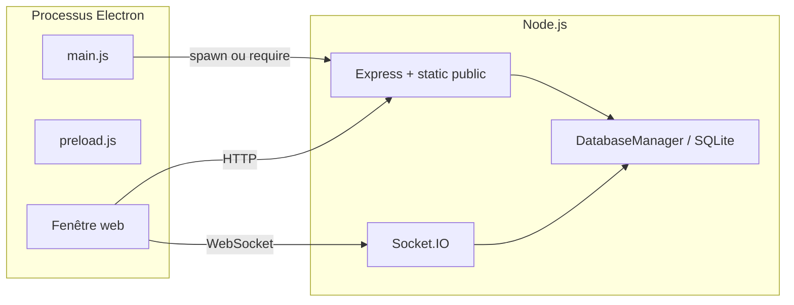

# Guide développeur — PERMAPPEL

Ce document décrit l’**architecture technique** et le **flux d’exécution** de l’application pour un développeur qui découvre le dépôt. Il complète le [README.md](README.md) (usage fonctionnel), [DEPLOYMENT.md](DEPLOYMENT.md) (exploitation) et [CONTRIBUTING.md](CONTRIBUTING.md) (workflow Git et conventions).

---

## 1. Vue d’ensemble

PERMAPPEL est une application **bureau** (Electron) dont l’interface est servie comme un **site web** par un serveur **Express** intégré. Les feuilles d’appel se synchronisent en temps réel via **Socket.IO**. Les données vivent dans une base **SQLite** dont le fichier est stocké dans un **répertoire partagé système** (ex. `ProgramData` sous Windows), pas dans le dossier du dépôt.

Schéma simplifié :



- **Processus principal** (`main.js`) : fenêtres, menu, démarrage du serveur en build packagé, gestion des fenêtres « feuille d’appel ».
- **Préchargement** (`preload.js`) : API minimale exposée au renderer via `contextBridge` (`electronAPI`).
- **Renderer** : pages dans `public/` ; chargées depuis `http://localhost:3001` (ou fichier en secours).

---

## 2. Démarrage : trois situations

### 2.1 Application installée / portable (`app.isPackaged`)

1. Electron démarre et appelle `startServer()` dans `main.js` (**uniquement** si `app.isPackaged`).
2. Le module `server/server.js` est **requiert** : au chargement, un script en bas de fichier instancie `PermappelServer` et appelle `start(3001)` de façon asynchrone ; `module.exports` expose la **classe** `PermappelServer`, mais c’est bien cet effet de bord qui ouvre l’écoute sur le port **3001**.
3. La fenêtre principale charge `http://localhost:3001`.

Le serveur tourne **dans le même processus Node** que le processus principal Electron (pas de `child_process` séparé dans ce flux : tout passe par `require('./server/server.js')`).

### 2.2 Développement avec `npm run dev` (recommandé)

1. **Terminal 1** : `cd server && npm start` — lance `node server.js`, ouvre la BDD, écoute sur **3001**.
2. **Terminal 2** : à la racine, `npm run dev` — Electron avec le flag `--dev` (DevTools). La fenêtre charge `http://localhost:3001` (le serveur doit déjà être up).

Tant que l’application **n’est pas packagée** (`app.isPackaged === false`), `main.js` **n’importe pas** `server/server.js` : il se contente de charger l’URL du serveur. Sans processus sur le port 3001, vous obtenez le repli `file://` sur `public/index.html`, souvent incompatible avec les appels API.

### 2.3 `npm start` à la racine sans serveur séparé

Sans build packagé, `main.js` tente de charger l’URL du serveur : si le serveur n’est pas démarré, un **fallback** charge `public/index.html` en `file://`, ce qui peut casser les appels API. En pratique, pour le dev, utiliser **deux terminaux** comme ci-dessus.

---

## 3. Backend : `server/server.js`

La classe **`PermappelServer`** construit :

| Composant | Rôle |
|-----------|------|
| `express()` | Application HTTP |
| `http.createServer` + `socketIo` | WebSocket pour le temps réel |
| `new DatabaseManager()` | Accès SQLite, chemins système, migrations |
| `securityConfig` | Restriction IP **globale** (clés `security_*` dans `config`) |

### 3.1 Ordre des middlewares Express

1. **Trust proxy** — pour `req.ip` derrière un reverse proxy éventuel.
2. **Restriction IP globale** — si `security_enabled` dans la BDD ; sinon `next()`.
3. **CORS** — headers larges + gestion `OPTIONS`.
4. **Logging** basique.
5. **`express.json()`** — corps JSON des API.
6. **`express.static('../public')`** — fichiers statiques (HTML, JS, CSS).

### 3.2 Montage des routes API

Préfixe **`/api`** :

| Chemin | Module | Rôle principal |
|--------|--------|----------------|
| `/api/auth` | `routes/auth.js` | Login, `/me` ; token = **id utilisateur** (chaîne), pas un JWT |
| `/api/students` | `routes/students.js` | CRUD élèves, import lié, autocomplete |
| `/api/attendance` | `routes/attendance.js` | Feuilles d’appel, présences ; reçoit `io` pour émissions |
| `/api/cdi` | `routes/cdi.js` | Borne CDI : créneau, activités, check-in, statut IP borne |
| `/api/schedules` | `routes/schedules.js` | Créneaux horaires |
| `/api/admin` | `routes/admin.js` | Utilisateurs, config, sécurité, sauvegarde BDD, etc. |
| `/api/export` | `routes/export.js` | Exports côté serveur si présents |
| `/api/import` | `routes/import.js` | Import fichiers (uploads sous répertoire partagé) |

**Garde « élève »** (middleware avant ces routes) : si `Authorization: Bearer <token>` correspond à un utilisateur avec `role === 'eleve'`, seules certaines sous-routes sont autorisées (`/auth/*`, `/cdi/*`, `/students/autocomplete`). Toute autre API renvoie **403**.

### 3.3 Socket.IO

- **Middleware** : même logique IP que HTTP si la restriction globale est active.
- **Événements typiques** : `authenticate` (token = id user), `join-attendance` / `leave-attendance`, `attendance-change`, messages de chat, etc.
- Les clients rejoignent des **rooms** `attendance-{id}` pour isoler les diffusions par feuille.

Pour la liste exacte des événements, parcourir `setupSocketHandlers()` dans `server.js` et les fichiers qui appellent `io.emit` / `socket.to(...).emit` (ex. `routes/attendance.js`, `routes/cdi.js`).

### 3.4 Sauvegardes automatiques

`setupAutoBackup()` enregistre une copie de la base **toutes les heures** dans le dossier `backups/` adjacent à `permappel.db` (voir `database.js`).

---

## 4. Base de données : `server/database.js`

- **`DatabaseManager`** : ouvre `permappel.db` sous un chemin **partagé** selon l’OS (Windows → `PROGRAMDATA\PERMAPPEL`, etc.).
- **`setupDatabase()`** : exécute le script SQL de création des tables (`utilisateurs`, `eleves`, `feuilles_appel`, `activites_cdi`, `presences`, `config`, …).
- **`insertDefaultData()`** : admin par défaut, groupes, activités CDI, clés `config` pour la borne CDI, etc.
- **`ensureCdiSchema()`** : migrations légères (ex. colonne `activiteCdiId` sur `presences`).

**Important** : le script racine **`init-database.js`** (`npm run init-db`) crée uniquement **`server/permappel.db`** dans le dépôt — utile pour du SQL local ; le serveur **ne l’utilise pas** par défaut. Ne pas confondre avec la base « réelle ».

---

## 5. Frontend : dossier `public/`

- **SPA principale** : `index.html` + scripts dans `public/js/` (`app.js`, `auth.js`, `attendance.js`, `students.js`, `security.js`, etc.).
- **Feuille d’appel** : `attendance.html` + `attendance-window.js` — souvent ouverte dans une **fenêtre Electron dédiée** (`createAttendanceWindow` dans `main.js`) quand l’URL contient `attendance.html`.
- **Borne CDI** : `cdi-kiosk.html` + `cdi-kiosk.js` — appelle `/api/cdi/*` et `/api/students/autocomplete`.
- **Config API** : `public/js/config.js` définit en général l’URL de base des fetch (à vérifier selon déploiement).

L’**export PDF** des feuilles est réalisé **côté client** avec **jsPDF** (`pdf-export.js`, chargement CDN avec repli local).

---

## 6. Borne CDI et double restriction IP

1. **Restriction globale** (toute l’app) : table `config`, clés `security_*`, configurable depuis l’admin — appliquée aux requêtes HTTP et aux connexions Socket.IO.
2. **Restriction bornes CDI** : logique séparée dans `server/middleware/cdiKioskIpRestriction.js` et routes `/api/cdi` ; clés `cdi_kiosk_*` dans `config`. Un poste peut être autorisé pour l’app mais bloqué pour la borne, ou l’inverse selon la configuration.

---

## 7. Authentification (implémentation actuelle)

- **Login** : `POST /api/auth/login` — bcrypt compare le mot de passe ; réponse `{ token, user }` où **`token` est l’id numérique de l’utilisateur en string**.
- **Requêtes suivantes** : header `Authorization: Bearer <token>`.
- Ce n’est **pas** un JWT : pas de signature, pas d’expiration côté token. Toute évolution vers JWT impliquerait de modifier `auth.js`, le middleware élève, et la doc.

---

## 8. Build et distribution

- **electron-builder** : configuration dans `package.json` (`build`) et fichiers d’artefacts sous `dist/`.
- Scripts utiles : `npm run build-portable`, `npm run build-installer`, `npm run build-win`, `npm run build`.
- Fichiers embarqués : voir la section `files` du `build` (racine : `main.js`, `preload.js`, `public`, `server`, etc.).

---

## 9. Fichiers utiles pour une prise en main rapide

| Ordre | Fichier | Intérêt |
|-------|---------|---------|
| 1 | `main.js` | Cycle de vie Electron, URL chargée, fenêtres d’appel |
| 2 | `server/server.js` | Routes, middlewares, Socket.IO |
| 3 | `server/database.js` | Schéma SQL, chemin BDD, sauvegardes |
| 4 | `server/routes/auth.js` | Login / token |
| 5 | `server/routes/attendance.js` | Cœur métier appels |
| 6 | `server/routes/cdi.js` | Borne CDI |
| 7 | `public/js/auth.js` | Redirection élève → `cdi-kiosk.html` |
| 8 | `public/js/attendance-window.js` | UI feuille + sockets |

---

## 10. Pièges courants

- **« J’ai lancé init-database mais l’app ne voit pas les données »** : la base lue par l’app est sous `ProgramData` (Windows), pas `server/permappel.db`.
- **« Les élèves voient toute l’admin »** : vérifier le rôle en BDD et le flux dans `auth.js` ; la garde serveur sur `/api` doit rester alignée avec les nouvelles routes.
- **« Socket ne connecte pas depuis le réseau »** : pare-feu, URL du client (`config.js`), et restriction IP globale.
- **« PDF ne s’affiche pas »** : jsPDF (réseau pour le CDN ou fichier local `jspdf.umd.min.js`).

---

## 11. Ressources externes du dépôt

- Issues / suivi : voir le lien dans le README si présent.
- Après modification du schéma : mettre à jour **`database.js`** en priorité ; si vous maintenez **`init-database.js`**, gardez-le aligné pour éviter la confusion entre environnements.

---

## 12. Inventaire exhaustif — événements Socket.IO

Les noms d’événements ci-dessous sont ceux utilisés dans **`server/server.js`**, **`server/routes/attendance.js`** et **`server/routes/cdi.js`**, ainsi que le client principal **`public/js/attendance-window.js`**.  
**Room** habituelle pour le travail sur une feuille : `attendance-{attendanceId}` où `attendanceId` est la chaîne composite **`{date}_{creneauId}`** (ex. `2025-03-24_3`).

### 12.1 Client → serveur (écouteurs `socket.on` dans `setupSocketHandlers`)

| Événement | Payload typique | Comportement |
|-----------|-----------------|--------------|
| `authenticate` | `{ token }` — `token` = id utilisateur (string), comme après login HTTP | Vérifie l’utilisateur en BDD ; en cas de succès : enregistre `socket.userId` / `socket.userName`, répond `authenticated`, met à jour la liste globale des connectés. |
| `join-attendance` | `{ attendanceId }` | `socket.join('attendance-' + attendanceId)` ; enregistre l’utilisateur dans `activeAttendances` ; émet `user-joined-attendance` aux autres ; puis `attendance-users-updated` à la room. |
| `leave-attendance` | `{ attendanceId }` **ou** l’id seul (nombre / string) | `socket.leave` ; retire l’utilisateur de `activeAttendances` ; `user-left-attendance` ; `attendance-users-updated`. |
| `attendance-change` | `{ attendanceId, studentId, status, notes?, activityId? }` | Met à jour `presences` via [`server/helpers/updatePresenceStatus.js`](server/helpers/updatePresenceStatus.js) (même SQL que le `PUT` REST) avec `modifiePar = socket.userId` ; en cas de succès : **`student-status-updated`** vers la room ; sinon `attendance-error` au socket émetteur. |
| `attendance-chat-message` | `{ attendanceId, message }` | Vérifie que le socket est dans `activeAttendances` pour cette feuille ; diffuse `attendance-chat-message` à la room avec `userId`, `userName`, `timestamp`. |

Événements **built-in** Socket.IO (non personnalisés) : connexion TCP / `connect`, `disconnect`, erreurs de transport.

**Debug** : un second `io.on('connection')` (en tête de `PermappelServer`) enregistre **`socket.onAny`** pour journaliser tous les noms d’événements reçus.

### 12.2 Serveur → client (`emit`)

| Événement | Cible | Payload (champs principaux) | Origine |
|-----------|--------|-----------------------------|---------|
| `authenticated` | Socket authentifié | `{ user }` (profil BDD) | `authenticate` OK |
| `auth_error` | Socket | `{ message }` | Échec `authenticate` |
| `user-joined-attendance` | Autres sockets de la room | `{ userId, userName }` | `join-attendance` |
| `user-left-attendance` | Autres sockets de la room | `{ userId, userName }` | `leave-attendance` |
| `attendance-error` | Socket ayant émis | `{ message }` | Échec de `attendance-change` (feuille introuvable, élève absent de la feuille, etc.) |
| `attendance-chat-message` | Room `attendance-*` | `{ attendanceId, userId, userName, message, timestamp }` | Relais chat |
| `users-updated` | **Tous** les clients (`io.emit`) | `{ users: [...] }` — liste des connectés (id, nom, rôle, etc.) | Connexion / déconnexion / auth |
| `attendance-users-updated` | Room `attendance-*` | `{ users: [...] }` — utilisateurs sur **cette** feuille | `broadcastAttendanceUsers` |
| `student-status-updated` | Room `attendance-*` | `{ attendanceId, studentId, status, notes?, timestamp }` | **`PUT /api/attendance/.../student/...`** ou succès de **`attendance-change`** (même payload via `buildStudentStatusSocketPayload`) |
| `attendance-students-updated` | Room `attendance-*` | `{ attendanceId, reason }` ; parfois `addedCount`, `removedCount` si `reason === 'sync-students'` | Routes HTTP feuille (groupes / classes / sync) — `reason` : `groups-added`, `group-removed`, `classes-added`, `class-removed`, `sync-students` |
| `cdi-checkin-updated` | Room `attendance-*` | `{ attendanceId, studentId, status, activity, timestamp }` | **HTTP** `POST /api/cdi/checkin` |

### 12.3 Cohérence REST / Socket pour les statuts

- La logique SQL unique vit dans **`server/helpers/updatePresenceStatus.js`** (`updatePresenceStatus`, `parseBearerUserId`, `buildStudentStatusSocketPayload`).
- Le **`PUT /api/attendance/:attendanceId/student/:studentId`** exige un en-tête **`Authorization: Bearer …`** valide pour renseigner **`modifiePar`** (plus de valeur `1` en dur).
- L’événement historique **`attendance-updated`** n’est plus émis : seul **`student-status-updated`** notifie les clients dans la room.

---

## 13. Inventaire exhaustif — routes HTTP

Préfixe d’API : **`/api`**. Les chemins ci-dessous sont **complets** (méthode + chemin).  
Sauf mention, les routes attendent un client authentifié côté UI ; le serveur applique la **garde « élève »** sur `/api` (voir section 3.2 du présent document).

### 13.1 Page et utilitaire

| Méthode | Chemin | Fichier | Rôle |
|---------|--------|---------|------|
| GET | `/` | `server.js` | Sert `public/index.html` |
| GET | `/api/server-info` | `server.js` | IP locale, port, uptime, nombre de connectés Socket.IO |

### 13.2 `/api/auth` — `routes/auth.js`

| Méthode | Chemin | Rôle |
|---------|--------|------|
| POST | `/api/auth/login` | Login ; corps JSON credentials ; réponse avec `token` (id user) |
| GET | `/api/auth/me` | Profil utilisateur courant (header `Authorization`) |

### 13.3 `/api/students` — `routes/students.js`

| Méthode | Chemin | Rôle |
|---------|--------|------|
| GET | `/api/students/autocomplete?q=` | Autocomplete borne CDI ; **restriction IP borne** si activée |
| GET | `/api/students` | Liste élèves (filtres query `search`, `class`, `group`) |
| GET | `/api/students/:id` | Détail élève |
| POST | `/api/students` | Création élève |
| PUT | `/api/students/:id` | Mise à jour élève |
| DELETE | `/api/students/:id` | Désactivation (`actif = 0`) |
| GET | `/api/students/classes/list` | Liste des classes (distinct depuis `eleves`) |
| GET | `/api/students/groups/list` | Liste des groupes |
| POST | `/api/students/groups` | Création groupe (`groupName`) |
| PUT | `/api/students/groups/:id` | Renommage groupe |
| DELETE | `/api/students/groups/:id` | Suppression groupe (si non utilisé) |
| POST | `/api/students/search` | Recherche avancée (`criteria[]`) |
| POST | `/api/students/bulk-assign-groups` | Affectation groupes en lot |
| POST | `/api/students/bulk-assign-exit-permission` | Autorisations de sortie en lot |

### 13.4 `/api/attendance` — `routes/attendance.js`

`attendanceId` ou `id` de feuille = **`{date}_{creneauId}`** (ex. `2025-03-24_2`).

| Méthode | Chemin | Rôle |
|---------|--------|------|
| GET | `/api/attendance` | Liste feuilles (query `date`, `scheduleId`, `startDate`, `endDate`) |
| GET | `/api/attendance/:id` | Détail d’une feuille + élèves |
| POST | `/api/attendance` | Création feuille(s) |
| PUT | `/api/attendance/:attendanceId/student/:studentId` | Mise à jour présence (`status`, `notes`, `activityId`) + emit `student-status-updated` |
| POST | `/api/attendance/:attendanceId/groups` | Ajout groupes à la feuille |
| DELETE | `/api/attendance/:attendanceId/groups` | Retrait d’un groupe (body `groupName`) |
| POST | `/api/attendance/:attendanceId/classes` | Ajout classes |
| DELETE | `/api/attendance/:attendanceId/classes` | Retrait d’une classe (body `className`) |
| POST | `/api/attendance/:id/sync-students` | Synchro élèves selon critères de la feuille |
| POST | `/api/attendance/:attendanceId/refresh` | Première population des `presences` si feuille vide |

### 13.5 `/api/cdi` — `routes/cdi.js`

| Méthode | Chemin | Rôle |
|---------|--------|------|
| GET | `/api/cdi/activities` | Liste activités CDI ; **restriction IP borne** si activée |
| GET | `/api/cdi/current-slot` | Créneau « en cours » pour la borne |
| GET | `/api/cdi/kiosk-status` | État restriction borne (pour UI) |
| POST | `/api/cdi/checkin` | Inscription élève au CDI sur la feuille du créneau ; emit `cdi-checkin-updated` |

### 13.6 `/api/schedules` — `routes/schedules.js`

| Méthode | Chemin | Rôle |
|---------|--------|------|
| GET | `/api/schedules` | Liste créneaux |
| GET | `/api/schedules/:id` | Détail créneau |
| POST | `/api/schedules` | Création |
| PUT | `/api/schedules/:id` | Mise à jour |
| DELETE | `/api/schedules/:id` | Suppression |

### 13.7 `/api/admin` — `routes/admin.js`

| Méthode | Chemin | Rôle |
|---------|--------|------|
| GET | `/api/admin/users` | Liste utilisateurs |
| GET | `/api/admin/users/:id` | Détail utilisateur |
| POST | `/api/admin/users` | Création utilisateur |
| PUT | `/api/admin/users/:id` | Mise à jour |
| DELETE | `/api/admin/users/:id` | Suppression |
| GET | `/api/admin/schedules` | Créneaux (vue admin) |
| POST | `/api/admin/schedules` | Création créneau (admin) |
| GET | `/api/admin/classes` | Classes |
| GET | `/api/admin/groups` | Groupes |
| GET | `/api/admin/config` | Configuration générale (paires clé/valeur) |
| PUT | `/api/admin/config` | Mise à jour config |
| GET | `/api/admin/database/backup` | Téléchargement / déclenchement sauvegarde BDD |
| POST | `/api/admin/database/delete-students` | Suppression données élèves (danger) |
| POST | `/api/admin/database/reset` | Réinitialisation BDD (danger) |
| GET | `/api/admin/establishment` | Infos établissement |
| PUT | `/api/admin/establishment` | Mise à jour établissement |
| GET | `/api/admin/security` | Config IP globale (`security_*`) |
| PUT | `/api/admin/security` | Mise à jour IP globale |
| GET | `/api/admin/cdi-kiosk-self-status` | Test IP client vs règles borne ; **réservé au personnel** (`requireNonEleveStaff`) |
| GET | `/api/admin/cdi-kiosk-security` | Lecture config borne CDI |
| PUT | `/api/admin/cdi-kiosk-security` | Écriture config borne CDI |

### 13.8 `/api/export` — `routes/export.js`

| Méthode | Chemin | Rôle |
|---------|--------|------|
| GET | `/api/export/attendance/:id` | Export données feuille |
| GET | `/api/export/attendance/date/:date` | Export par date |
| GET | `/api/export/students` | Export élèves |

### 13.9 `/api/import` — `routes/import.js`

| Méthode | Chemin | Rôle |
|---------|--------|------|
| GET | `/api/import/template` | Modèle fichier import |
| POST | `/api/import/students` | Upload CSV (multer) |

### 13.10 Fichiers statiques

Tout ce qui n’est pas une route API est servi par **`express.static`** sur **`public/`** (HTML, CSS, JS, images).

---

## 14. Schéma SQL (référence)

Source : fonction **`setupDatabase()`** dans [`server/database.js`](server/database.js), complétée au démarrage par **`ensureCdiSchema()`** (table `activites_cdi` si besoin, colonne `presences.activiteCdiId`).

### 14.1 DDL des tables (tel que dans le dépôt)

`activites_cdi` est créée **avant** `presences` (contrainte `activiteCdiId`). Les PRAGMA (`foreign_keys=ON`, etc.) sont exécutés **dans le même `serialize` que `setupDatabase()`**, après ouverture du fichier, pour que les `FOREIGN KEY` soient prises en compte lors du `CREATE TABLE`.

```sql
-- utilisateurs
CREATE TABLE IF NOT EXISTS utilisateurs (
    id INTEGER PRIMARY KEY AUTOINCREMENT,
    nomUtilisateur TEXT UNIQUE NOT NULL,
    nom TEXT NOT NULL,
    prenom TEXT NOT NULL,
    email TEXT UNIQUE NOT NULL,
    motDePasse TEXT NOT NULL,
    role TEXT DEFAULT 'Professeur',
    actif INTEGER DEFAULT 1,
    creeLe DATETIME DEFAULT CURRENT_TIMESTAMP
);

-- classes (référentiel optionnel ; les élèves portent aussi un champ texte classe)
CREATE TABLE IF NOT EXISTS classes (
    id INTEGER PRIMARY KEY AUTOINCREMENT,
    nom TEXT UNIQUE NOT NULL,
    niveau TEXT,
    description TEXT,
    creeLe DATETIME DEFAULT CURRENT_TIMESTAMP
);

CREATE TABLE IF NOT EXISTS groupes (
    id INTEGER PRIMARY KEY AUTOINCREMENT,
    nom TEXT UNIQUE NOT NULL,
    matiere TEXT,
    description TEXT,
    creeLe DATETIME DEFAULT CURRENT_TIMESTAMP
);

CREATE TABLE IF NOT EXISTS creneaux (
    id INTEGER PRIMARY KEY AUTOINCREMENT,
    nom TEXT NOT NULL,
    heureDebut TIME NOT NULL,
    heureFin TIME NOT NULL,
    description TEXT,
    actif INTEGER DEFAULT 1,
    creeLe DATETIME DEFAULT CURRENT_TIMESTAMP
);

CREATE TABLE IF NOT EXISTS eleves (
    id INTEGER PRIMARY KEY AUTOINCREMENT,
    nom TEXT NOT NULL,
    prenom TEXT NOT NULL,
    dateNaissance DATE DEFAULT '1900-01-01',
    classe TEXT NOT NULL,
    regime TEXT DEFAULT 'Externe',
    autorisationSortie TEXT DEFAULT 'ND',
    actif INTEGER DEFAULT 1,
    creeLe DATETIME DEFAULT CURRENT_TIMESTAMP,
    modifieLe DATETIME DEFAULT CURRENT_TIMESTAMP
);

CREATE TABLE IF NOT EXISTS eleves_groupes (
    eleveId INTEGER,
    groupeId INTEGER,
    PRIMARY KEY (eleveId, groupeId),
    FOREIGN KEY (eleveId) REFERENCES eleves(id) ON DELETE CASCADE,
    FOREIGN KEY (groupeId) REFERENCES groupes(id) ON DELETE CASCADE
);

CREATE TABLE IF NOT EXISTS feuilles_appel (
    id INTEGER PRIMARY KEY AUTOINCREMENT,
    date DATE NOT NULL,
    creneauId INTEGER NOT NULL,
    classes TEXT,
    groupes TEXT,
    creePar INTEGER NOT NULL,
    creeLe DATETIME DEFAULT CURRENT_TIMESTAMP,
    modifieLe DATETIME DEFAULT CURRENT_TIMESTAMP,
    FOREIGN KEY (creneauId) REFERENCES creneaux(id),
    FOREIGN KEY (creePar) REFERENCES utilisateurs(id),
    UNIQUE(date, creneauId)
);

CREATE TABLE IF NOT EXISTS activites_cdi (
    id INTEGER PRIMARY KEY AUTOINCREMENT,
    libelle TEXT UNIQUE NOT NULL,
    actif INTEGER DEFAULT 1,
    creeLe DATETIME DEFAULT CURRENT_TIMESTAMP
);

CREATE TABLE IF NOT EXISTS presences (
    id INTEGER PRIMARY KEY AUTOINCREMENT,
    feuilleAppelId INTEGER NOT NULL,
    eleveId INTEGER NOT NULL,
    statut TEXT NOT NULL DEFAULT 'NON_APPELE',
    notes TEXT,
    activiteCdiId INTEGER,
    modifiePar INTEGER NOT NULL,
    modifieLe DATETIME DEFAULT CURRENT_TIMESTAMP,
    FOREIGN KEY (feuilleAppelId) REFERENCES feuilles_appel(id) ON DELETE CASCADE,
    FOREIGN KEY (eleveId) REFERENCES eleves(id),
    FOREIGN KEY (activiteCdiId) REFERENCES activites_cdi(id),
    FOREIGN KEY (modifiePar) REFERENCES utilisateurs(id),
    UNIQUE(feuilleAppelId, eleveId)
);

CREATE TABLE IF NOT EXISTS etablissement (
    id INTEGER PRIMARY KEY,
    nom TEXT NOT NULL,
    adresse TEXT,
    telephone TEXT,
    email TEXT,
    directeur TEXT,
    modifieLe DATETIME DEFAULT CURRENT_TIMESTAMP
);

CREATE TABLE IF NOT EXISTS config (
    cle TEXT PRIMARY KEY,
    valeur TEXT,
    description TEXT,
    modifieLe DATETIME DEFAULT CURRENT_TIMESTAMP
);
```

### 14.2 PRAGMA et migrations runtime

- Au chargement de la BDD : `journal_mode=WAL`, `busy_timeout=30000`, **`foreign_keys=ON`**, etc., puis `exec` du DDL — le tout enchaîné dans le **callback d’ouverture** de la connexion (`initDatabase()`), pas après la fin de `setupDatabase()` depuis une file séparée.
- **`ensureCdiSchema()`** : `CREATE TABLE IF NOT EXISTS activites_cdi` ; si `presences` n’a pas la colonne **`activiteCdiId`**, exécution de `ALTER TABLE presences ADD COLUMN activiteCdiId INTEGER`.

### 14.3 Valeurs métier courantes pour `presences.statut`

Exemples utilisés dans les requêtes et routes : `NON_APPELE`, `Présent`, `Absent`, `Présent_CDI`, `Absence_prévue`, etc. (voir agrégations dans `routes/attendance.js`).

### 14.4 Clés `config` documentées dans le code

| Clé | Usage |
|-----|--------|
| `security_enabled` | Activer la restriction IP globale (`true` / `false`) |
| `security_allowedIPs` | JSON tableau d’IP |
| `security_allowedRanges` | JSON tableau de plages `{ base, start, end }` |
| `cdi_kiosk_ip_restriction_enabled` | Restriction IP **borne CDI** |
| `cdi_kiosk_allowed_ips` | JSON tableau d’IP autorisées pour la borne |

D’autres clés peuvent être ajoutées via **`PUT /api/admin/config`** selon l’évolution du projet.

---

*Dernière mise à jour de cet inventaire : à réviser lors de toute modification de `server.js`, des fichiers dans `server/routes/` ou de `setupDatabase` / `ensureCdiSchema`.*

Bon développement sur PERMAPPEL.
